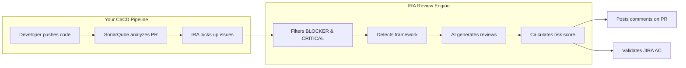
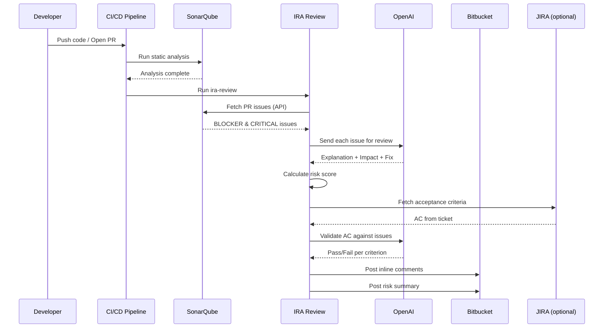

# ira-review

**AI-powered PR reviews with built-in JIRA intelligence.**

We've all been there. SonarQube flags a bunch of issues on your PR, and now someone has to go through each one, understand what it actually means, and figure out how to fix it. It's tedious and eats up review time.

IRA takes that off your plate. It picks up your SonarQube issues, sends them through AI, and posts clear comments right on your pull request with an explanation, the impact, and a suggested fix. On top of that, it scores the overall risk of your PR, flags complex code, and can even check your JIRA acceptance criteria automatically.

## Language and framework support

IRA works with **any language** that SonarQube or SonarCloud can analyze. It doesn't read your source code directly. It picks up the issues that Sonar already found and sends them to AI for explanation and fixes. So if Sonar can analyze your code, IRA can review it.

IRA itself is an npm package and needs Node.js to run, but your project doesn't have to be a JavaScript project. You just run IRA as a CLI tool in your pipeline, the same way you'd use any other linting or code quality tool.

### JavaScript and TypeScript projects

JS/TS projects get the most out of IRA. You can install it as a dev dependency and use the CLI or the programmatic API directly.

```bash
npm install --save-dev ira-review
npx ira-review review --pr 42 --dry-run
```

IRA also auto-detects your framework and tailors AI suggestions to match its conventions:

| Framework | How it's detected |
|---|---|
| React | `react` in `package.json` dependencies |
| Angular | `@angular/core` in `package.json` dependencies |
| Vue | `vue` in `package.json` dependencies |
| NestJS | `@nestjs/core` in `package.json` dependencies |
| Node.js | `package.json` exists (fallback) |

### Java, Kotlin, Scala, and other JVM projects

You don't need to touch your `pom.xml` or `build.gradle`. Just add a step in your CI that runs IRA using `npx`. Most CI runners already have Node.js installed.

```yaml
# GitHub Actions example
- uses: actions/setup-node@v4
  with:
    node-version: 20
- run: npx ira-review review --pr ${{ github.event.pull_request.number }} --dry-run
```

### Python projects

Same idea. Just run IRA as a one-off command in your pipeline.

```yaml
# GitHub Actions example
- uses: actions/setup-node@v4
  with:
    node-version: 20
- run: npx ira-review review --pr ${{ github.event.pull_request.number }} --dry-run
```

You can also add it to a Makefile if that's how your team works:

```makefile
review:
	npx ira-review review --pr $(PR) --dry-run
```

### Go, Rust, C#, PHP, Ruby, Swift, and everything else

It all works the same way. If Node.js is available in your CI environment (and it almost always is), just run:

```bash
npx ira-review review \
  --sonar-url https://sonarcloud.io \
  --sonar-token $SONAR_TOKEN \
  --project-key my-project \
  --pr $PR_ID \
  --dry-run
```

`npx` downloads and runs IRA on the fly, so there's nothing to install beforehand.

### No Node.js? Use Docker

If your CI environment doesn't have Node.js and you can't install it, you can run IRA through Docker:

```bash
docker run --rm node:20-slim npx ira-review review \
  --sonar-url https://sonarcloud.io \
  --sonar-token $SONAR_TOKEN \
  --project-key my-project \
  --pr $PR_ID \
  --dry-run
```

## How it works



Here's the full flow in detail:



## What it does

1. Pulls issues from SonarQube or SonarCloud for a specific pull request
2. Filters them down to what actually matters (BLOCKER and CRITICAL severity only)
3. Detects your framework (React, Angular, Vue, NestJS, Node) to give smarter suggestions
4. Sends each issue to AI for a plain-English explanation and a concrete fix
5. Calculates a risk score for the PR based on issues, security concerns, and complexity
6. Analyzes code complexity and highlights the hotspots
7. Validates JIRA acceptance criteria against the PR (if you've set up JIRA)
8. Posts inline comments back to your pull request on Bitbucket

## Install

```bash
npm install ira-review
```

## Quick start

The fastest way to try it out. This runs against your real Sonar data but prints everything to your terminal instead of posting to Bitbucket, so you don't need a Bitbucket token.

```bash
export OPENAI_API_KEY=[REDACTED:api-key]

npx ira-review review \
  --sonar-url https://sonarcloud.io \
  --sonar-token sqa_xxxxx \
  --project-key my-org_my-project \
  --pr 42 \
  --dry-run
```

Once you're happy with how it works, drop the `--dry-run` flag and add your Bitbucket credentials to start posting comments on real PRs:

```bash
npx ira-review review \
  --sonar-url https://sonarcloud.io \
  --sonar-token sqa_xxxxx \
  --project-key my-org_my-project \
  --pr 42 \
  --bitbucket-token bb_xxxxx \
  --repo my-workspace/my-repo
```

## PR risk scoring

Every review automatically calculates a risk score based on five factors:

| Factor | Max Points | What it measures |
|---|---|---|
| Blocker Issues | 30 | Number of blocker-level issues |
| Critical Issues | 20 | Number of critical-level issues |
| Issue Density | 15 | Issues per file changed |
| Security Concerns | 20 | Vulnerabilities, CWE/OWASP-tagged issues |
| Code Complexity | 15 | Files with cyclomatic/cognitive complexity > 15 |

Risk levels: **LOW** (0-19), **MEDIUM** (20-39), **HIGH** (40-59), **CRITICAL** (60+)

In dry-run mode you'll see something like:

```
═══════════════════════════════════════════════════
🟠 PR Risk Score: HIGH (45/100)
═══════════════════════════════════════════════════
   ▓ Blocker Issues: 20/30 - 2 blocker issues found
   ▓ Security Concerns: 10/20 - 1 security-related issue
   ▓ Code Complexity: 10/15 - 2 high-complexity files
   ▓ Critical Issues: 5/20 - 1 critical issue found
   ░ Issue Density: 0/15 - 0.5 issues per file changed
```

## Code complexity insights

IRA fetches complexity metrics from SonarQube's measures API and flags the files that need attention:

- **Cyclomatic complexity** tells you how many paths exist through the code
- **Cognitive complexity** tells you how hard it is to understand
- **Lines of code** per file gives you a sense of scale

Any file with complexity above 15 gets flagged as a hotspot. This feeds into the risk score and shows up in dry-run output.

## JIRA acceptance criteria validation

If your team tracks acceptance criteria in JIRA, IRA can check whether a PR actually meets them. This is completely optional and only kicks in when you provide your JIRA config.

```bash
npx ira-review review \
  --sonar-url https://sonarcloud.io \
  --sonar-token sqa_xxxxx \
  --project-key my-org_my-project \
  --pr 42 \
  --jira-url https://yourcompany.atlassian.net \
  --jira-email dev@company.com \
  --jira-token jira_xxxxx \
  --jira-ticket PROJ-123 \
  --dry-run
```

IRA fetches the JIRA ticket, pulls out the acceptance criteria, and uses AI to check each one against the SonarQube analysis. The output looks like:

```
✅ JIRA Acceptance: PROJ-123 - Add user authentication
   ✅ CRITERION_1: MET - Authentication endpoint implemented
      No blocker issues in auth module
   ❌ CRITERION_2: NOT_MET - Input validation
      Critical security issue found in login handler
```

If your team stores acceptance criteria in a custom field, just pass the field ID:

```bash
--jira-ac-field customfield_10042
```

The default field is `customfield_10035`.

## Using it in code

If you want more control, you can use IRA programmatically instead of the CLI:

```typescript
import { ReviewEngine } from "ira-review";

const engine = new ReviewEngine({
  sonar: {
    baseUrl: "https://sonarcloud.io",
    token: "sqa_xxxxx",
    projectKey: "my-org_my-project",
  },
  scm: {
    token: "bb_xxxxx",
    workspace: "my-workspace",
    repoSlug: "my-repo",
  },
  ai: {
    provider: "openai",
    apiKey: process.env.OPENAI_API_KEY!,
  },
  pullRequestId: "42",
  // Optional JIRA integration
  jira: {
    baseUrl: "https://yourcompany.atlassian.net",
    email: "dev@company.com",
    token: "jira_xxxxx",
  },
  jiraTicket: "PROJ-123",
});

const result = await engine.run();

console.log(`Risk: ${result.risk?.level}`);
console.log(`Complexity hotspots: ${result.complexity?.hotspots.length}`);
console.log(`AC validation: ${result.acceptanceValidation?.overallPass}`);
```

If you just want to preview without posting anything, add `dryRun: true` to the config.

## Environment variables

If you're tired of passing flags every time, set these environment variables instead. CLI flags still take priority if you pass both.

| Variable | What it does |
|---|---|
| `OPENAI_API_KEY` | Your OpenAI API key (required) |
| `IRA_SONAR_URL` | SonarQube/SonarCloud URL |
| `IRA_SONAR_TOKEN` | Sonar API token |
| `IRA_PROJECT_KEY` | Sonar project key |
| `IRA_PR` | Pull request ID |
| `IRA_BITBUCKET_TOKEN` | Bitbucket API token |
| `IRA_BITBUCKET_URL` | Bitbucket Server URL (only for self-hosted) |
| `IRA_REPO` | `workspace/repo-slug` format |
| `IRA_JIRA_URL` | JIRA base URL (optional) |
| `IRA_JIRA_EMAIL` | JIRA account email (optional) |
| `IRA_JIRA_TOKEN` | JIRA API token (optional) |

You can also copy `.env.example` to `.env` and fill in the values there.

## CI/CD example

Here's how you'd wire it into a Bitbucket Pipeline:

```yaml
pipelines:
  pull-requests:
    '**':
      - step:
          name: AI Code Review
          script:
            - npx ira-review review --pr $BITBUCKET_PR_ID --repo $BITBUCKET_REPO_FULL_NAME
          environment:
            OPENAI_API_KEY: $OPENAI_API_KEY
            IRA_SONAR_URL: $SONAR_URL
            IRA_SONAR_TOKEN: $SONAR_TOKEN
            IRA_PROJECT_KEY: $SONAR_PROJECT_KEY
            IRA_BITBUCKET_TOKEN: $BB_TOKEN
```

All tokens come from your pipeline's secret variables. IRA never stores or transmits them anywhere else.

## What the comments look like

When IRA posts to your PR, each comment looks something like this:

```
🔍 IRA Review - typescript:S1854 (BLOCKER)

> Remove this useless assignment to local variable "data".

Explanation: The variable "data" is assigned a value that is never used
before being reassigned on line 15. This is dead code that adds confusion.

Impact: Dead code makes the codebase harder to read and maintain. It can
also mask real bugs if developers assume the assignment has a purpose.

Suggested Fix: Remove the assignment on line 10 entirely, or if the
variable is needed later, move the declaration to where it's first used.
```

## CLI reference

```
ira-review review [options]

Options:
  --sonar-url <url>          SonarQube base URL
  --sonar-token <token>      Sonar API token
  --project-key <key>        Sonar project key
  --pr <id>                  Pull request ID
  --bitbucket-token <token>  Bitbucket API token
  --repo <repo>              workspace/repo-slug
  --ai-provider <provider>   AI provider (default: openai)
  --ai-model <model>         AI model (default: gpt-4o-mini)
  --bitbucket-url <url>      Bitbucket base URL (self-hosted)
  --dry-run                  Print to terminal instead of posting
  --jira-url <url>           JIRA base URL
  --jira-email <email>       JIRA account email
  --jira-token <token>       JIRA API token
  --jira-ticket <key>        JIRA ticket key (e.g. PROJ-123)
  --jira-ac-field <field>    Custom field ID for acceptance criteria
```

## How it's built

```
src/
  core/
    sonarClient.ts           Sonar API client with pagination and retry
    issueProcessor.ts        Filters and groups issues by file
    reviewEngine.ts          Orchestrates the full review pipeline
    riskScorer.ts            Calculates PR risk score from 5 factors
    complexityAnalyzer.ts    Fetches and analyzes code complexity metrics
    acceptanceValidator.ts   Validates JIRA acceptance criteria using AI
  ai/
    aiClient.ts              Pluggable AI provider (OpenAI for now)
    promptBuilder.ts         Builds structured prompts per issue
  scm/
    bitbucket.ts             Posts inline PR comments
  integrations/
    jiraClient.ts            JIRA REST API client
  frameworks/
    detector.ts              Auto-detects React, Angular, Vue, NestJS, Node
  utils/
    retry.ts                 Exponential backoff with jitter
    concurrency.ts           Caps parallel AI calls (default: 3)
    env.ts                   Resolves config from env vars and CLI flags
  types/
    config.ts                All config interfaces
    sonar.ts                 Sonar API types
    review.ts                Review result types and provider interfaces
    risk.ts                  Risk scoring and complexity types
    jira.ts                  JIRA and acceptance criteria types
```

## Built-in reliability

All external API calls to Sonar, OpenAI, Bitbucket, and JIRA automatically retry up to 3 times with exponential backoff. AI calls run with a concurrency limit of 3 so you don't hit rate limits. If something optional like complexity analysis or JIRA validation fails, the review still completes and the failure shows up as a warning instead of crashing the whole run. You don't need to configure any of this.

## Security

Your tokens are safe.

- IRA runs on your servers, not ours. It's just an npm package. When it runs in your CI/CD pipeline, your tokens stay in your infrastructure. The package author has zero access to them.
- The code is fully open source. Every line is auditable. Tokens are only used in `Authorization` headers to APIs you already own.
- Only compiled code ships to npm. No source files, no config, no secrets. Just the `dist/` folder.
- There's no telemetry, no analytics, and no tracking. The only network calls IRA makes are to the APIs you explicitly configure: Sonar, OpenAI, Bitbucket, and optionally JIRA.

Think of it like ESLint or the AWS CLI. You install it, give it your credentials at runtime, and it does its job. Nobody else sees your data.

## Development

```bash
npm install          # install deps
npm run typecheck    # type check
npm test             # run all 74 tests
npm run test:watch   # watch mode
npm run build        # build ESM + CJS + types
```

## Requirements

- Node.js 18+
- A SonarQube or SonarCloud project with PR analysis enabled
- An OpenAI API key (pay-per-use, not free tier)
- A Bitbucket repo with an open pull request
- JIRA Cloud instance for acceptance criteria validation (optional)

## License

MIT
