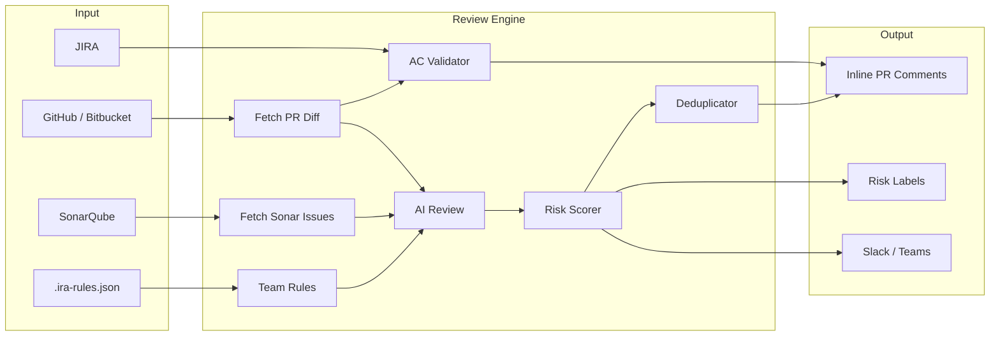

# IRA - Intelligent Review Assistant

IRA reviews pull requests before your team does. It reads the full PR diff, runs each changed file through an AI model, scores the overall risk, and optionally validates the changes against JIRA acceptance criteria. The output is a set of inline comments posted directly on the PR with explanations, impact assessments, and suggested fixes.

It runs as a CLI tool, a VS Code extension, or inside CI pipelines. Everything executes locally. No code or credentials leave your infrastructure.

[](https://marketplace.visualstudio.com/items?itemName=ira-review.ira-review-vscode)
[](https://www.npmjs.com/package/ira-review)

---

## Why This Exists

Code review is a bottleneck in most teams. PRs sit for hours or days waiting for a human reviewer. When the review finally happens, a significant portion of the comments are mechanical: missing input validation, hardcoded secrets, unhandled edge cases, acceptance criteria not covered.

These are all things a machine can catch.

IRA does not replace human reviewers. It handles the first pass so that when a human does review, they can focus on architecture, design, and business logic instead of pointing out that you forgot to sanitize user input.

The specific gap IRA fills:
- **Linters** catch syntax and style issues. They do not understand intent.
- **SAST tools** scan for known vulnerability patterns. They do not assess business logic.
- **Copilot** helps you write code. It does not review code you already wrote.
- **IRA** reviews the complete PR diff with AI, scores the risk, and validates against the actual JIRA ticket. It bridges the gap between static analysis and human judgment.

---

## How It Works

IRA runs a 13-step pipeline for each review. Every step after step 1 is designed to soft-fail, so a partial configuration (e.g., no SonarQube, no JIRA) still produces useful output.

```
1.  Fetch SonarQube issues (if configured)
2.  Filter issues by minimum severity threshold
3.  Detect project framework (React, Angular, Vue, NestJS, Node)
4.  Load team review rules from .ira-rules.json (if present)
5.  Analyze code complexity metrics (if SonarQube is connected)
6.  Fetch PR diff from GitHub/Bitbucket
7.  Fetch source files for changed files (for full-file context)
8.  Run AI review on each file/issue (concurrent, configurable model)
9.  Calculate risk score (0-100) from issue severity, complexity, and security signals
10. Validate JIRA acceptance criteria against the diff (if configured)
11. Deduplicate: skip issues already commented on in previous runs
12. Post summary + inline comments to the PR
13. Send Slack/Teams notification (if configured, respects risk threshold)
```

Two review modes:
- **Sonar + AI mode**: SonarQube finds issues, AI explains each one with context, impact, and a fix
- **Standalone AI mode**: AI reviews the raw diff directly and identifies issues on its own

Both modes produce the same output format: inline comments on specific lines with severity, explanation, impact, and suggested fix.

---

## Architecture



```
src/
  ai/           AI provider abstraction (OpenAI, Anthropic, Azure, Ollama)
  core/         Review engine, risk scorer, acceptance validator, test generator
  scm/          GitHub and Bitbucket clients (diff, comments, labels, build status)
  integrations/ JIRA client, Slack/Teams notifier
  frameworks/   Framework detector (React, Angular, Vue, NestJS, Node)
  types/        Shared TypeScript interfaces
  utils/        Config resolution, concurrency helpers
  cli.ts        CLI entry point (Commander.js)

packages/
  vscode/       VS Code extension (diagnostics, CodeLens, TreeView, dashboard)
```

The core review engine (`src/core/reviewEngine.ts`) is a single orchestrator that wires together all components. The VS Code extension and CLI both call the same engine, so behavior is identical across surfaces.

---

## Key Features

### Risk Scoring (0-100)

Every review produces a composite risk score based on:
- Number and severity of blocker/critical/major issues
- Security-related findings (SQL injection, hardcoded secrets, auth bypasses)
- Code complexity metrics (when SonarQube is connected)

The score maps to a level: LOW (0-19), MEDIUM (20-39), HIGH (40-59), CRITICAL (60-100). On GitHub, IRA applies color-coded labels (`ira:critical`, `ira:high`, etc.) to the PR. On Bitbucket, it posts a build status.

### JIRA Acceptance Criteria Validation

IRA fetches the linked JIRA ticket, extracts the acceptance criteria, and uses the AI model to determine which criteria the PR diff covers and which it does not. The output includes:
- Per-criterion pass/fail status with coverage percentage
- Edge cases the AC implies but the code does not handle
- A summary posted as a PR comment

This is the feature that catches "does this actually match the ticket?" before a human has to ask.

### Inline AI Comments

Each issue is posted as an inline comment on the exact line in the PR, containing:
- **Rule**: Category (e.g., `IRA/security`, `IRA/best-practice`)
- **Severity**: BLOCKER, CRITICAL, MAJOR, MINOR, INFO
- **Explanation**: What the problem is
- **Impact**: What happens if it is not fixed
- **Suggested Fix**: Code-level recommendation

### Comment Deduplication

IRA tracks which comments it has already posted on a PR. Re-running a review on the same PR will only post new findings, not duplicate previous ones.

### Test Case Generation

Given a JIRA ticket, IRA generates test cases from the acceptance criteria in your chosen framework. Supported: Jest, Vitest, Mocha, Playwright, Cypress, Gherkin, Pytest, JUnit.

### Smart Notifications

Slack and Teams notifications can be filtered by risk threshold and AC failure status. You control exactly when your team gets notified.

### Custom Review Rules

Teams define their own review standards in a `.ira-rules.json` file committed to the repo root. Rules are loaded at review time and injected into the AI prompt alongside the diff, so the model checks for team-specific violations in the same pass as general issues. No separate analysis pass, no extra API calls.

Each rule has a `message` (what to tell the developer), a `severity` (BLOCKER, CRITICAL, MAJOR, MINOR), and optionally `bad`/`good` code examples and `paths` to scope the rule to specific directories.

```json
{
  "rules": [
    {
      "message": "Use parameterized queries for all SQL operations",
      "bad": "db.query(`SELECT * FROM users WHERE id = ${userId}`)",
      "good": "db.query('SELECT * FROM users WHERE id = $1', [userId])",
      "severity": "CRITICAL",
      "paths": ["src/db/**", "src/api/**"]
    },
    {
      "message": "Never use console.log in production code, use the logger service",
      "bad": "console.log('User created:', user);",
      "good": "logger.info('User created', { userId: user.id });",
      "severity": "MINOR"
    }
  ]
}
```

Rules without `paths` apply to all files. Rules with `paths` are only checked against matching files. The file is validated at load time: invalid severity values and missing required fields are skipped with a warning. Maximum 30 rules per file. IRA rules are for nuanced, context-dependent standards that linters cannot express. Deterministic checks (naming conventions, import order, formatting) belong in ESLint.

Rules are enforced in all review surfaces (CLI, CI/CD, VS Code extension) with no license gating. In the VS Code extension, run `IRA: Init Rules File` from the command palette to scaffold an empty `.ira-rules.json`. The extension ships a JSON Schema for the file, so you get autocomplete and validation as you edit.

---

## Privacy and Local-First Design

IRA is not a SaaS product. There is no hosted service, no telemetry, no analytics, and no token forwarding.

| Surface | How secrets are stored |
|---|---|
| VS Code Extension | OS keychain via SecretStorage (macOS Keychain, Windows Credential Manager, Linux libsecret) |
| CLI | Environment variables, read at runtime, never written to disk |
| CI Pipelines | Your CI secrets manager (GitHub Actions secrets, Jenkins credentials, etc.) |

- GitHub auth uses VS Code's built-in OAuth (same mechanism as Copilot)
- Config files (`.irarc.json`) block token fields by design
- AI API calls go directly from your machine to your chosen provider. IRA is not a proxy
- The authentication module is a single file with full test coverage

---

## CLI vs VS Code Extension

| | CLI | VS Code Extension |
|---|---|---|
| **Use case** | CI pipelines, scripting, headless environments | Interactive development |
| **AI default** | OpenAI (requires API key) | GitHub Copilot (zero config) |
| **Auth** | Environment variables or CLI flags | VS Code OAuth + OS keychain |
| **Output** | Terminal + PR comments | Inline diagnostics, CodeLens, TreeView, risk badge |
| **JIRA/Sonar** | CLI flags or env vars | VS Code settings |
| **Pro features** | Not applicable | Auto-review on save, one-click fix, history/trends |

Both surfaces use the same core review engine. The review logic, risk scoring, and AI prompts are identical.

---

## Example Output

**Risk summary posted on the PR:**

```
# IRA Review Summary

## Risk: MEDIUM (47/100)

| Factor        | Score | Detail                          |
|---------------|-------|---------------------------------|
| Blocker Issues| 10/30 | 1 blocker issue found           |
| Critical Issues| 8/25 | 1 critical issue found         |
| Major Issues  | 5/15  | 1 major issue found             |
| Security      | 14/20 | 2 security-related issues       |
| Complexity    | 0/10  | 0 high-complexity files         |
```

**JIRA acceptance criteria validation:**

```
Requirements: AUTH-234 - 67% Complete (4/6 AC met)

  [PASS] OAuth2 login flow implemented with Google provider
  [PASS] JWT tokens generated on successful authentication
  [PASS] Refresh token rotation with 7-day expiry
  [FAIL] Input validation on login endpoint - no email format check
  [PASS] Logout endpoint clears session and revokes token
  [FAIL] Rate limiting on login attempts - not implemented

  Edge Cases Not Covered:
     - What happens when Google OAuth is unreachable?
     - Token refresh during concurrent requests?
```

**Inline comment on the PR:**

```
IRA/security (CRITICAL) - src/routes/auth.ts:42

User input used directly in SQL query without sanitization.

Explanation: The username parameter is concatenated into a SQL string,
creating a SQL injection vector.

Impact: Attacker could execute arbitrary SQL and gain database control.

Suggested Fix: Use parameterized queries:
  db.query('SELECT * FROM users WHERE name = $1', [username])
```

---

## Quick Start

### VS Code (recommended for individual developers)

1. Install from the [VS Code Marketplace](https://marketplace.visualstudio.com/items?itemName=ira-review.ira-review-vscode)
2. Open a project with a GitHub or Bitbucket remote
3. `Cmd+Shift+P` > `IRA: Review Current PR`
4. Enter your PR number

If you have GitHub Copilot, that is all you need. No API keys, no configuration.

### CLI

```bash
npx ira-review review \
  --pr 42 \
  --scm-provider github \
  --github-token "$GITHUB_TOKEN" \
  --github-repo owner/repo \
  --ai-api-key "$OPENAI_API_KEY" \
  --dry-run
```

Drop `--dry-run` to post comments directly on the PR.

### GitHub Actions

```yaml
name: AI Code Review
on:
  pull_request:
    types: [opened, synchronize]

jobs:
  review:
    runs-on: ubuntu-latest
    steps:
      - uses: actions/setup-node@v4
        with:
          node-version: 20
      - run: |
          npx ira-review review \
            --pr ${{ github.event.pull_request.number }} \
            --scm-provider github \
            --github-token ${{ secrets.GITHUB_TOKEN }} \
            --github-repo ${{ github.repository }} \
            --no-config-file
        env:
          IRA_AI_API_KEY: ${{ secrets.OPENAI_API_KEY }}
```

### Bitbucket Pipelines

```yaml
pipelines:
  pull-requests:
    '**':
      - step:
          name: AI Code Review
          script:
            - npx ira-review review
                --pr $BITBUCKET_PR_ID
                --repo $BITBUCKET_REPO_FULL_NAME
                --no-config-file
          environment:
            IRA_AI_API_KEY: $OPENAI_API_KEY
            IRA_BITBUCKET_TOKEN: $BB_TOKEN
```

---

## Adding JIRA and SonarQube

Both integrations are optional and additive. IRA works with just an SCM provider and an AI key.

**JIRA:**
```bash
npx ira-review review \
  --pr 42 \
  --scm-provider github \
  --github-token "$GITHUB_TOKEN" \
  --github-repo owner/repo \
  --ai-api-key "$OPENAI_API_KEY" \
  --jira-url https://yourcompany.atlassian.net \
  --jira-email you@company.com \
  --jira-token "$JIRA_TOKEN" \
  --jira-ticket AUTH-234
```

**SonarQube:**
```bash
npx ira-review review \
  --pr 42 \
  --scm-provider github \
  --github-token "$GITHUB_TOKEN" \
  --github-repo owner/repo \
  --ai-api-key "$OPENAI_API_KEY" \
  --sonar-url https://sonarcloud.io \
  --sonar-token "$SONAR_TOKEN" \
  --project-key my-org_my-project
```

---

## Supported Providers

### SCM

| Provider | Status |
|---|:---:|
| GitHub | Supported |
| GitHub Enterprise | Supported |
| Bitbucket Cloud | Supported |
| Bitbucket Server / Data Center | Supported |

### AI

| Provider | Notes |
|---|---|
| GitHub Copilot | VS Code only, zero config, uses existing session |
| OpenAI | Default for CLI |
| Azure OpenAI | Requires `--ai-base-url` and `--ai-deployment` |
| Anthropic | Pass key with `--ai-api-key` |
| Ollama | Fully local, no API key needed |

**Cost optimization:** Use `--ai-model gpt-4o-mini` for most issues and `--ai-model-critical gpt-4o` for blockers. This keeps costs low without sacrificing quality on critical findings.

---

## Config File

Create `.irarc.json` in your project root to set defaults:

```json
{
  "scmProvider": "github",
  "githubRepo": "owner/repo",
  "aiModel": "gpt-4o-mini",
  "minSeverity": "MAJOR"
}
```

CLI flags override environment variables, which override the config file. Token fields are blocked from config files by design.

## Requirements

- Node.js 18+
- An AI provider API key (or Ollama running locally, or GitHub Copilot for the VS Code extension)
- A GitHub or Bitbucket repo with an open PR

## License

[Proprietary](LICENSE). See LICENSE file for details.

Full CLI reference: `npx ira-review review --help`

## Links

- [VS Code Marketplace](https://marketplace.visualstudio.com/items?itemName=ira-review.ira-review-vscode)
- [npm package](https://www.npmjs.com/package/ira-review)
- Support: patilmayur5572@gmail.com
