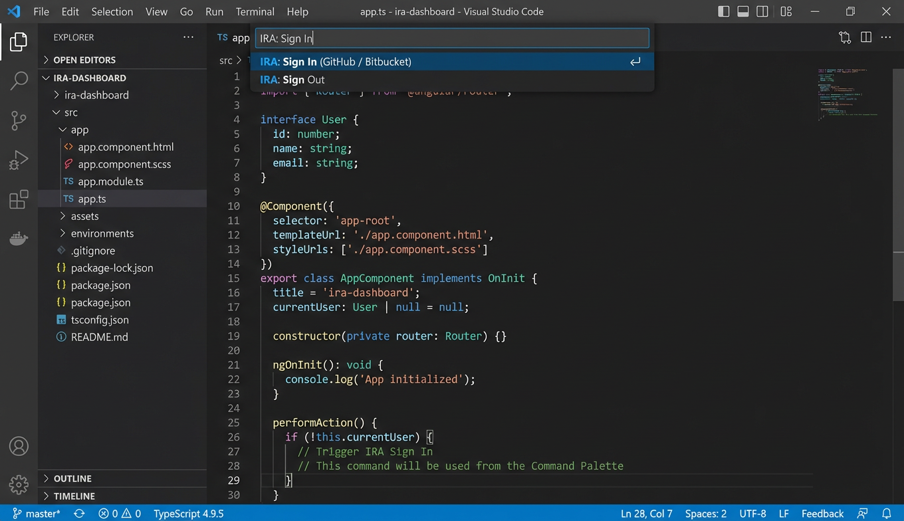
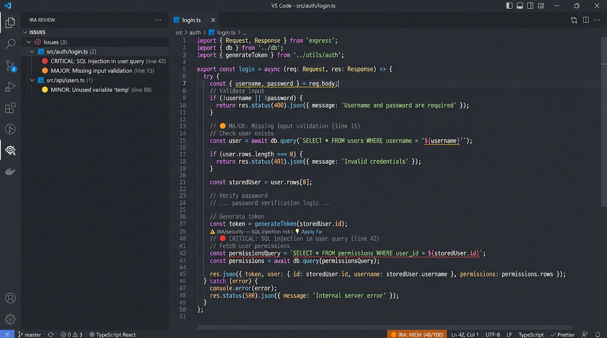
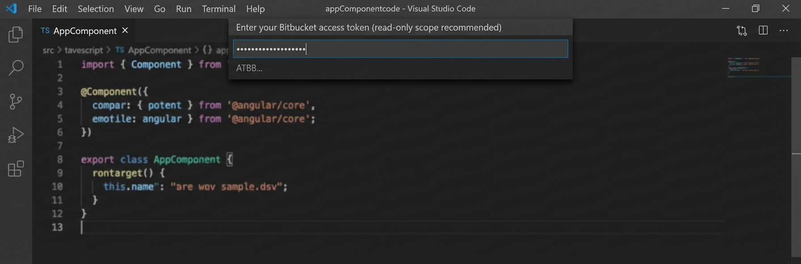
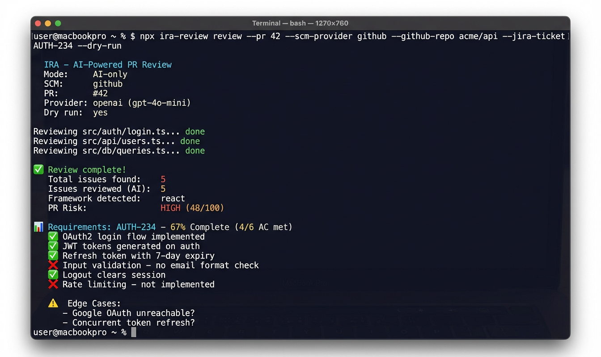
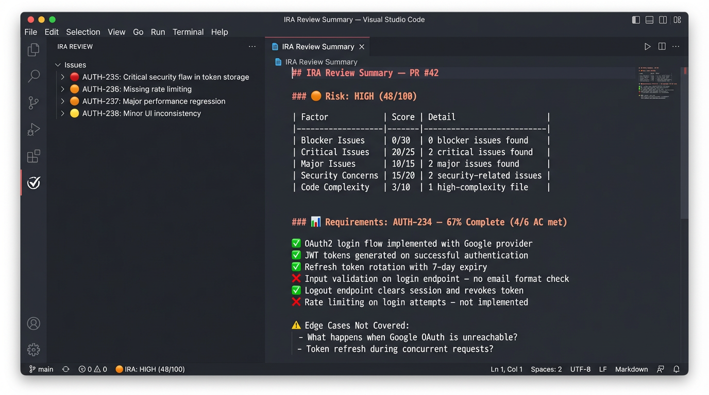

# IRA - AI-Powered Code Reviews for Pull Requests


[](https://marketplace.visualstudio.com/items?itemName=ira-review.ira-review-vscode)
[](https://www.npmjs.com/package/ira-review)

IRA (Intelligent Review Assistant) reviews your pull requests using AI. It posts inline comments with explanations, impact assessments, and suggested fixes directly on your PR.

**Works with any language.** Supports GitHub, GitHub Enterprise, Bitbucket Cloud, and Bitbucket Server/Data Center.

**Free for core features.** Review PRs, score risk, validate JIRA acceptance criteria, and generate tests. [Pro features](#vs-code-pro-features) available for $10/mo.

> 🧩 **[VS Code Extension](https://marketplace.visualstudio.com/items?itemName=ira-review.ira-review-vscode)** - AI reviews inside your editor with zero-config Copilot support
>
> 📦 **[npm package](https://www.npmjs.com/package/ira-review)** - CLI and CI integration

## 🔒 Security First - No Secret Ever Touches Disk in Plaintext

This is a core design principle, not an afterthought. Every token is encrypted at rest using OS-native credential storage.

| Where | How secrets are stored | Details |
|---|---|---|
| **VS Code Extension** | OS keychain (macOS Keychain, Windows Credential Manager, Linux libsecret) | GitHub uses VS Code OAuth. Bitbucket, Sonar, JIRA, and AI keys use SecretStorage |
| **CLI** | Environment variables | Read from `IRA_*` env vars at runtime. Never written to disk |
| **CI Pipelines** | Your CI secrets manager | GitHub Actions secrets, Jenkins credentials, HashiCorp Vault, Azure Key Vault, etc. |

**What this means for your team:**
- GitHub users authenticate with one click via VS Code OAuth. No tokens to copy or paste
- Bitbucket users enter their token once in a masked prompt. It goes straight to the OS keychain
- Copilot users need zero configuration. It uses the existing VS Code GitHub session
- `IRA: Sign Out` wipes all secrets from the keychain in one command
- Token refresh is automatic. IRA detects VS Code session changes and invalidates stale tokens
- No cloud service, no telemetry, no analytics. Code and tokens never leave your infrastructure
- Config files (`.irarc.json`) block token fields by design

> **For your security team:** IRA is not a SaaS. It runs entirely on developer machines and CI runners. Tokens are used only to call APIs you already trust (GitHub, Bitbucket, SonarQube, JIRA, OpenAI). The authentication module is a single auditable file with full test coverage.

---

## What can IRA do?

- **Review your code** using AI and post inline comments with explanation, impact, and fix
- **Score PR risk** from 0 to 100 and auto-label your PRs on GitHub
- **Track requirement completion** against JIRA acceptance criteria with percentage and per-criterion status
- **Generate test cases** from JIRA tickets in 8 frameworks (Jest, Vitest, Mocha, Playwright, Cypress, Gherkin, Pytest, JUnit)
- **Enrich SonarQube issues** with AI-powered explanations when Sonar is connected
- **Notify your team** via Slack or Microsoft Teams after each review

---

## Setup Guides

### VS Code Extension with GitHub



1. Install the extension: search **"IRA - AI Code Reviews"** in the Extensions panel, or run:
   ```bash
   code --install-extension ira-review.ira-review-vscode
   ```
2. Open a project with a GitHub remote
3. Run `IRA: Sign In` from the Command Palette (`Cmd+Shift+P` / `Ctrl+Shift+P`)
4. Click "Sign in with GitHub" in the popup. VS Code handles the OAuth flow
5. Run `IRA: Review Current PR` and enter your PR number



That's it. Copilot is the default AI provider, so no API key is needed.

**Optional - switch AI provider:**
- Open Settings > Extensions > IRA
- Change `ira.aiProvider` to `openai`, `anthropic`, or `ollama`
- Run `IRA: Sign In` again to store your AI API key securely

**Optional - connect SonarQube:**
- Set `ira.sonarUrl` to your SonarQube server URL
- The Sonar token is stored securely in the OS keychain via `IRA: Sign In`
- Set `ira.sonarProjectKey` in settings

**Optional - connect JIRA:**
- Set `ira.jiraUrl` and `ira.jiraEmail` in settings
- The JIRA token is stored securely in the OS keychain via `IRA: Sign In`

### VS Code Extension with Bitbucket

1. Install the extension (same as above)
2. Open a project with a Bitbucket remote
3. Run `IRA: Review Current PR` from the Command Palette
4. IRA auto-detects Bitbucket from your git remote URL
5. A masked input box appears: paste your Bitbucket access token (read-only scope recommended)
6. The token is stored in the OS keychain. You will not be asked again



**For Bitbucket Server / Data Center:**
- Set `ira.bitbucketUrl` to your server URL (e.g. `https://bitbucket.yourcompany.com`)

### CLI with GitHub



```bash
# Install (optional - you can use npx directly)
npm install -g ira-review

# Run a review
npx ira-review review \
  --pr 42 \
  --scm-provider github \
  --github-token 'ghp_xxxxx' \
  --github-repo owner/repo \
  --ai-api-key 'sk-xxxxx' \
  --dry-run
```

Drop `--dry-run` to post comments directly on the PR.

**Add JIRA validation:**
```bash
npx ira-review review \
  --pr 42 \
  --scm-provider github \
  --github-token 'ghp_xxxxx' \
  --github-repo owner/repo \
  --ai-api-key 'sk-xxxxx' \
  --jira-url https://yourcompany.atlassian.net \
  --jira-email you@company.com \
  --jira-token 'jira_xxxxx' \
  --jira-ticket AUTH-234
```

**Add SonarQube:**
```bash
npx ira-review review \
  --pr 42 \
  --scm-provider github \
  --github-token 'ghp_xxxxx' \
  --github-repo owner/repo \
  --ai-api-key 'sk-xxxxx' \
  --sonar-url https://sonarcloud.io \
  --sonar-token 'sqa_xxxxx' \
  --project-key my-org_my-project
```

### CLI with Bitbucket

```bash
npx ira-review review \
  --pr 42 \
  --bitbucket-token 'bb_xxxxx' \
  --repo my-workspace/my-repo \
  --ai-api-key 'sk-xxxxx' \
  --dry-run
```

**For Bitbucket Server / Data Center:**
```bash
npx ira-review review \
  --pr 42 \
  --bitbucket-token 'bb_xxxxx' \
  --repo my-workspace/my-repo \
  --bitbucket-url https://bitbucket.yourcompany.com \
  --ai-api-key 'sk-xxxxx'
```

### CI with GitHub Actions

```yaml
name: AI Code Review
on:
  pull_request:
    types: [opened, synchronize]

jobs:
  review:
    runs-on: ubuntu-latest
    steps:
      - uses: actions/setup-node@v4
        with:
          node-version: 20
      - run: |
          npx ira-review review \
            --pr ${{ github.event.pull_request.number }} \
            --scm-provider github \
            --github-token ${{ secrets.GITHUB_TOKEN }} \
            --github-repo ${{ github.repository }} \
            --no-config-file
        env:
          IRA_AI_API_KEY: ${{ secrets.OPENAI_API_KEY }}
```

**Add JIRA + Sonar in CI:**
```yaml
      - run: |
          npx ira-review review \
            --pr ${{ github.event.pull_request.number }} \
            --scm-provider github \
            --github-token ${{ secrets.GITHUB_TOKEN }} \
            --github-repo ${{ github.repository }} \
            --sonar-url ${{ vars.SONAR_URL }} \
            --sonar-token ${{ secrets.SONAR_TOKEN }} \
            --project-key ${{ vars.SONAR_PROJECT_KEY }} \
            --jira-url ${{ vars.JIRA_URL }} \
            --jira-email ${{ vars.JIRA_EMAIL }} \
            --jira-token ${{ secrets.JIRA_TOKEN }} \
            --jira-ticket AUTH-234 \
            --no-config-file
        env:
          IRA_AI_API_KEY: ${{ secrets.OPENAI_API_KEY }}
```

All tokens come from GitHub Actions secrets. Nothing is hardcoded.

### CI with Bitbucket Pipelines

```yaml
pipelines:
  pull-requests:
    '**':
      - step:
          name: AI Code Review
          script:
            - npx ira-review review
                --pr $BITBUCKET_PR_ID
                --repo $BITBUCKET_REPO_FULL_NAME
                --no-config-file
          environment:
            IRA_AI_API_KEY: $OPENAI_API_KEY
            IRA_BITBUCKET_TOKEN: $BB_TOKEN
```

**With Bitbucket Server + JIRA + Sonar:**
```yaml
pipelines:
  pull-requests:
    '**':
      - step:
          name: AI Code Review
          script:
            - npx ira-review review
                --pr $BITBUCKET_PR_ID
                --repo $BITBUCKET_REPO_FULL_NAME
                --bitbucket-url $BITBUCKET_SERVER_URL
                --sonar-url $SONAR_URL
                --sonar-token $SONAR_TOKEN
                --project-key $SONAR_PROJECT_KEY
                --jira-url $JIRA_URL
                --jira-email $JIRA_EMAIL
                --jira-token $JIRA_TOKEN
                --jira-ticket AUTH-234
                --no-config-file
          environment:
            IRA_AI_API_KEY: $OPENAI_API_KEY
            IRA_BITBUCKET_TOKEN: $BB_TOKEN
```

> Use `--no-config-file` in CI pipelines that run on untrusted PRs (forks, external contributors).

---

## What's New in v1.1.0

- **🔒 Zero Plaintext Secrets** - all tokens (GitHub, Bitbucket, Sonar, JIRA, AI API keys) now use OS-native keychain storage via VS Code SecretStorage. Nothing is stored in `settings.json` anymore
- **OAuth Authentication** - sign in with GitHub via VS Code's built-in OAuth flow. No more copying Personal Access Tokens
- **GitHub Enterprise OAuth** - full support for GHE instances via the `github-enterprise` authentication provider
- **Bitbucket Secure Token Storage** - Bitbucket tokens stored in OS keychain instead of plain-text settings
- **Token Refresh Awareness** - automatic cache invalidation when VS Code detects session changes (token refresh, sign-out)
- **Centralized Auth** - unified authentication service with per-provider session caching for consistent, secure auth across all commands
- **Sign In / Sign Out Commands** - dedicated `IRA: Sign In` and `IRA: Sign Out` commands for managing authentication
- **PAT Fallback** - existing Personal Access Token workflows continue to work. OAuth is additive, not a breaking change

### Authentication: OAuth vs Personal Access Token (PAT)

| | OAuth (new in v1.1.0) | Personal Access Token (PAT) |
|---|---|---|
| **Setup** | One-click sign-in via VS Code | Manually generate token on GitHub/Bitbucket, paste into settings |
| **Security** | Token managed by VS Code, stored in OS keychain | Token stored in VS Code settings (plain text in `settings.json`) |
| **Scopes** | Requests `repo` scope automatically | You choose scopes manually when creating the token |
| **Token Rotation** | Handled automatically by VS Code | Manual - you must regenerate expired tokens |
| **GitHub Enterprise** | ✅ Supported (org admin may need to approve the VS Code OAuth app) | ✅ Supported |
| **Bitbucket** | Token stored securely via SecretStorage | Token stored in settings |
| **Multi-account** | Managed by VS Code account system | One token per settings entry |
| **Offline / CI** | Not applicable (VS Code only) | ✅ Works in CI/CD and headless environments |

> **GHE Note:** If your organization uses GitHub Enterprise, an org admin may need to approve the VS Code GitHub authentication app before OAuth will work. Users can still fall back to PATs in the meantime.

<details>
<summary>Previous releases</summary>

#### v1.0.0

- **⚠️ Breaking:** Rule prefixes renamed from `ai/` to `IRA/` (e.g. `IRA/security`, `IRA/best-practice`)
- **Risk scoring v2** - BLOCKER issues now set a minimum HIGH severity floor; CRITICAL issues set minimum MEDIUM
- **VS Code Extension** - full-featured editor integration with Pro tier (auto-review, apply fix, trends dashboard)
- **Notifications** - Slack and Teams now available in both CLI and VS Code extension
- **Bug fix** - Security issues are now correctly detected and classified (stale prefix was preventing detection)
- **License** - switched to proprietary license

</details>

## Example output



**JIRA requirement tracking posted on your PR:**

```
📊 Requirements: AUTH-234 - 67% Complete (4/6 AC met)

  ✅ OAuth2 login flow implemented with Google provider
  ✅ JWT tokens generated on successful authentication
  ✅ Refresh token rotation with 7-day expiry
  ❌ Input validation on login endpoint - no email format check
  ✅ Logout endpoint clears session and revokes token
  ❌ Rate limiting on login attempts - not implemented

  ⚠️ Edge Cases Not Covered:
     - What happens when Google OAuth is unreachable?
     - Token refresh during concurrent requests?
```

**Inline comments on the exact lines:**

```
🔍 IRA Review - IRA/security (CRITICAL)

> User input used directly in SQL query without sanitization.

Explanation: The username parameter is concatenated into a SQL string,
creating a SQL injection vector.

Impact: Attacker could execute arbitrary SQL and gain database control.

Suggested Fix: Use parameterized queries:
  db.query('SELECT * FROM users WHERE name = $1', [username])
```

## Quick reference

| What you want | What to add | Example |
|---|---|---|
| AI-only review | `--pr`, SCM token, `--ai-api-key` | `npx ira-review review --pr 42 --scm-provider github --github-token ghp_xxx --github-repo owner/repo --ai-api-key sk-xxx` |
| + SonarQube | `--sonar-url`, `--sonar-token`, `--project-key` | `... --sonar-url https://sonarcloud.io --sonar-token sqa_xxx --project-key my-org_my-project` |
| + JIRA validation | `--jira-url`, `--jira-email`, `--jira-token`, `--jira-ticket` | `... --jira-url https://acme.atlassian.net --jira-email dev@acme.com --jira-token xxx --jira-ticket AUTH-234` |
| + Test generation | `--generate-tests`, `--test-framework` | `... --generate-tests --test-framework vitest` |
| + Slack notifications | `--slack-webhook` | `... --slack-webhook https://hooks.slack.com/services/xxx` |
| + Teams notifications | `--teams-webhook` | `... --teams-webhook https://outlook.office.com/webhook/xxx` |
| Notify only high risk | `--notify-min-risk` | `... --notify-min-risk high` |
| Notify on AC failure | `--notify-on-ac-fail` | `... --notify-on-ac-fail` |
| Risk labels | Automatic on GitHub | Labels like `ira:critical`, `ira:high`, `ira:medium`, `ira:low` |
| Preview in terminal | `--dry-run` | `... --dry-run` |
| Use Anthropic | `--ai-provider anthropic` | `... --ai-provider anthropic --ai-api-key sk-ant-xxx` |
| Use Ollama (free) | `--ai-provider ollama` | `... --ai-provider ollama` (no API key needed) |
| Save on AI costs | `--ai-model` + `--ai-model-critical` | `... --ai-model gpt-4o-mini --ai-model-critical gpt-4o` |
| Generate tests only | `generate-tests` command | `npx ira-review generate-tests --jira-ticket AUTH-234 --test-framework jest --ai-api-key sk-xxx` |
| Save tests to file | `--output` | `... --output tests/auth.test.ts` |

## Supported test frameworks

| Framework | Language | Style |
|---|---|---|
| `jest` | JavaScript/TypeScript | `describe` / `it` / `expect` |
| `vitest` | JavaScript/TypeScript | `describe` / `it` / `expect` |
| `mocha` | JavaScript/TypeScript | `describe` / `it` + Chai |
| `playwright` | TypeScript | `test` / `page` / E2E |
| `cypress` | JavaScript | `cy.visit` / `cy.get` / E2E |
| `gherkin` | Any (BDD) | `Given` / `When` / `Then` |
| `pytest` | Python | `def test_` / `assert` |
| `junit` | Java/Kotlin | `@Test` / `assertEquals` |

## AI providers

| Provider | Flag | Notes |
|---|---|---|
| **OpenAI** (default for CLI) | `--ai-provider openai` | Pass key with `--ai-api-key` or set `IRA_AI_API_KEY` |
| **GitHub Copilot** (default for VS Code) | `ira.aiProvider: copilot` | Zero config. Uses existing VS Code auth |
| **Azure OpenAI** | `--ai-provider azure-openai` | Also needs `--ai-base-url` and `--ai-deployment` |
| **Anthropic** | `--ai-provider anthropic` | Pass key with `--ai-api-key` or set `IRA_AI_API_KEY` |
| **Ollama** (local) | `--ai-provider ollama` | Runs locally, no API key needed |

> **Tip:** Use `--ai-model gpt-4o-mini` for most issues and `--ai-model-critical gpt-4o` for blockers. This keeps costs low without sacrificing quality on critical findings.

## Smart notifications

By default, IRA sends a Slack or Teams notification after every review. You can control exactly when notifications fire so your team only hears about what matters.

| Setup | What happens | Best for |
|---|---|---|
| No flags set | Every review triggers a notification | Small teams that want full visibility |
| `--notify-min-risk high` | Only HIGH and CRITICAL PRs trigger notifications | Reducing noise |
| `--notify-min-risk high --notify-on-ac-fail` | Notifies on HIGH/CRITICAL risk or when JIRA AC fail | Recommended for tech leads |
| `--notify-on-ac-fail` alone | Every review notifies, AC failures guaranteed | Never miss an AC failure |

### What triggers a notification?

| PR risk | AC status | No flags | `--notify-min-risk high` | `+ --notify-on-ac-fail` |
|---|---|---|---|---|
| LOW (5) | AC passes | ✅ Notified | Silent | Silent |
| LOW (12) | AC fails | ✅ Notified | Silent | ✅ Notified |
| MEDIUM (25) | AC passes | ✅ Notified | Silent | Silent |
| HIGH (45) | AC passes | ✅ Notified | ✅ Notified | ✅ Notified |
| CRITICAL (72) | AC fails | ✅ Notified | ✅ Notified | ✅ Notified |

### Configuration

All three ways to set this up:

```bash
# CLI flags
--notify-min-risk high --notify-on-ac-fail

# Environment variables (works in CI)
IRA_NOTIFY_MIN_RISK=high
IRA_NOTIFY_ON_AC_FAIL=true

# Config file (.irarc.json)
{ "notifyMinRisk": "high", "notifyOnAcFail": true }
```

## PR risk visibility

IRA makes risk visible directly in your PR list so tech leads can prioritize without opening each PR.

### GitHub: risk labels

IRA applies color-coded labels to your PRs after each review:

| Label | Score | Color |
|---|---|---|
| `ira:critical` | 60 to 100 | 🔴 Red |
| `ira:high` | 40 to 59 | 🟠 Orange |
| `ira:medium` | 20 to 39 | 🟡 Yellow |
| `ira:low` | 0 to 19 | 🟢 Green |

Labels update automatically when risk changes. Filter your PR list with `label:ira:critical label:ira:high` to prioritize reviews.

### Bitbucket: build status

Bitbucket does not support PR labels, so IRA posts a **build status** on the PR commit instead. This shows as a status icon in the PR list.

| Risk level | Build status | Icon in PR list |
|---|---|---|
| CRITICAL | FAILED | 🔴 Red X |
| HIGH | FAILED | 🔴 Red X |
| MEDIUM | INPROGRESS | 🟡 Yellow dot |
| LOW | SUCCESSFUL | 🟢 Green check |

Hover over the icon to see the full risk score. You can also configure Bitbucket branch permissions to **block merging** when the IRA Risk status is FAILED.

## Config file

Create `.irarc.json` in your project root to set defaults:

```json
{
  "scmProvider": "github",
  "githubRepo": "owner/repo",
  "aiModel": "gpt-4o-mini",
  "minSeverity": "MAJOR"
}
```

CLI flags override env vars, which override the config file. Tokens and keys are blocked from config files for security.

## Requirements

- Node.js 18+
- An AI provider API key (or Ollama running locally, or GitHub Copilot for the VS Code extension)
- A GitHub or Bitbucket repo with an open PR

## License

[Proprietary](LICENSE). See LICENSE file for details.

📖 **Full CLI reference:** Run `npx ira-review review --help`
