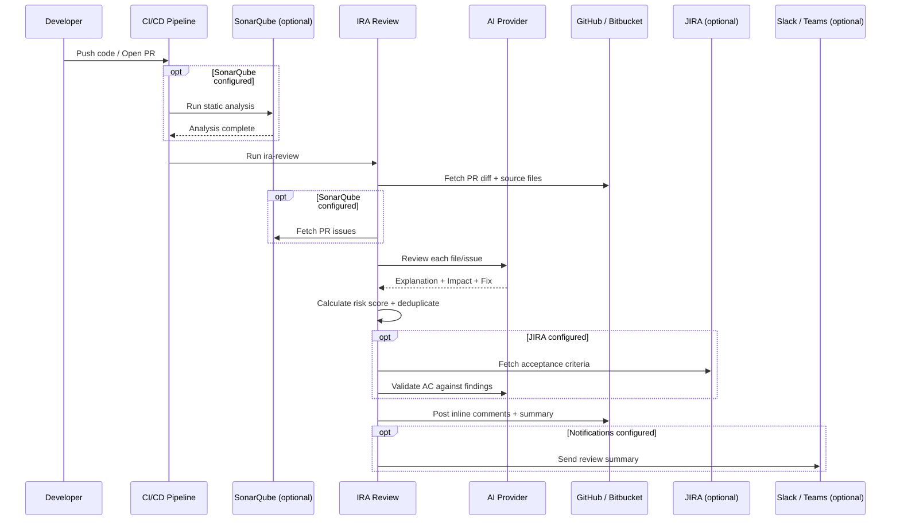

# ira-review

**AI-powered PR reviews with optional SonarQube, JIRA, and Slack/Teams integration.**

IRA (Intelligent Review Assistant) reviews your pull requests using AI. Point it at a PR and it posts inline comments with plain-English explanations, impact assessments, and suggested fixes. It works in two modes:

- **AI-only** - reviews your PR diff directly, finds bugs, security issues, and performance problems
- **Sonar + AI** - pulls SonarQube issues and enriches them with AI-powered explanations and fixes

Works with **any language**. Supports **GitHub** and **Bitbucket** (Cloud & Server). Runs as a CLI tool in your pipeline - your project doesn't need to be JavaScript.

## 30-second demo

```bash
# Try it right now - no install needed
export IRA_AI_API_KEY=sk-xxxxx

npx ira-review review \
  --pr 42 \
  --scm-provider github \
  --github-token ghp_xxxxx \
  --github-repo owner/repo \
  --dry-run
```

Drop `--dry-run` to post comments directly on the PR.

## Install

```bash
npx ira-review review --pr 42 --dry-run          # run once, no install
npm install --save-dev ira-review                  # add to project
npm install -g ira-review                          # install globally
```

---

## Quick start

### AI-only review (no SonarQube)

IRA fetches your PR diff and runs a full AI code review - finding bugs, security issues, and performance problems.

```bash
npx ira-review review \
  --pr 42 \
  --scm-provider github \
  --github-token ghp_xxxxx \
  --github-repo owner/repo
```

### Sonar + AI review

Add your SonarQube config to get issue-level analysis with AI explanations:

```bash
npx ira-review review \
  --pr 42 \
  --sonar-url https://sonarcloud.io \
  --sonar-token sqa_xxxxx \
  --project-key my-org_my-project \
  --bitbucket-token bb_xxxxx \
  --repo my-workspace/my-repo
```

### Choose your AI provider

IRA supports four AI providers. Set your provider with `--ai-provider`:

<table>
<tr><th>Provider</th><th>Command</th></tr>
<tr><td><b>OpenAI</b> (default)</td><td>

```bash
export IRA_AI_API_KEY=sk-xxxxx
npx ira-review review --pr 42 --dry-run
```

</td></tr>
<tr><td><b>Azure OpenAI</b></td><td>

```bash
export IRA_AI_API_KEY=xxxxx
npx ira-review review --pr 42 \
  --ai-provider azure-openai \
  --ai-base-url https://my-instance.openai.azure.com \
  --ai-deployment gpt-4o \
  --ai-api-version 2024-08-01-preview \
  --dry-run
```

</td></tr>
<tr><td><b>Anthropic</b></td><td>

```bash
export IRA_AI_API_KEY=sk-ant-xxxxx
npx ira-review review --pr 42 \
  --ai-provider anthropic \
  --ai-model claude-sonnet-4-20250514 \
  --dry-run
```

</td></tr>
<tr><td><b>Ollama</b> (local, no key)</td><td>

```bash
npx ira-review review --pr 42 \
  --ai-provider ollama \
  --ai-model codellama \
  --ai-base-url http://localhost:11434 \
  --dry-run
```

</td></tr>
</table>

> **Tip:** Use `--ai-model-critical gpt-4o` to route BLOCKER/CRITICAL issues to a stronger model while keeping costs low for everything else.

---

## CI/CD setup

### GitHub Actions

```yaml
name: AI Code Review
on:
  pull_request:
    types: [opened, synchronize]

jobs:
  review:
    runs-on: ubuntu-latest
    steps:
      - uses: actions/setup-node@v4
        with:
          node-version: 20

      - run: npx ira-review review
             --pr ${{ github.event.pull_request.number }}
             --scm-provider github
             --github-token ${{ secrets.GITHUB_TOKEN }}
             --github-repo ${{ github.repository }}
             --no-config-file
        env:
          IRA_AI_API_KEY: ${{ secrets.OPENAI_API_KEY }}
```

> Add `IRA_SONAR_URL`, `IRA_SONAR_TOKEN`, and `IRA_PROJECT_KEY` env vars for Sonar + AI mode. Without them, IRA runs in AI-only mode.

### Bitbucket Pipelines

```yaml
pipelines:
  pull-requests:
    '**':
      - step:
          name: AI Code Review
          script:
            - npx ira-review review
                --pr $BITBUCKET_PR_ID
                --repo $BITBUCKET_REPO_FULL_NAME
                --no-config-file
          environment:
            IRA_AI_API_KEY: $OPENAI_API_KEY
            IRA_BITBUCKET_TOKEN: $BB_TOKEN
```

### Any language, any CI

IRA is an npm package, but your project can be anything - Java, Python, Go, Rust, C#, PHP, Ruby. If Node.js is available (and it almost always is), just add `npx ira-review review ...` as a step.

```bash
# No Node.js? Use Docker
docker run --rm node:20-slim npx ira-review review --pr $PR_ID --dry-run
```

> **Security:** Use `--no-config-file` in CI pipelines that run on untrusted PRs (forks, external contributors). This prevents a malicious `.irarc.json` in the PR from altering review behavior.

---

## What IRA posts on your PR

### Inline comments

Each issue gets an inline comment on the exact line:

```
🔍 IRA Review - typescript:S1854 (BLOCKER)

> Remove this useless assignment to local variable "data".

Explanation: The variable "data" is assigned a value that is never used
before being reassigned on line 15. This is dead code that adds confusion.

Impact: Dead code makes the codebase harder to read and maintain. It can
also mask real bugs if developers assume the assignment has a purpose.

Suggested Fix: Remove the assignment on line 10 entirely, or if the
variable is needed later, move the declaration to where it's first used.
```

### Summary comment

Every PR also gets a summary with risk score, issue breakdown, complexity hotspots, and JIRA validation results:

```
# 🔍 IRA Review Summary

## 🟠 Risk: HIGH (45/100)

| Factor           | Score | Detail                        |
|-------------------|-------|-------------------------------|
| Blocker Issues    | 20/30 | 2 blocker issues found        |
| Security Concerns | 10/20 | 1 security-related issue      |
| Code Complexity   | 10/15 | 2 high-complexity files       |
| Critical Issues   | 5/20  | 1 critical issue found        |
| Issue Density     | 0/15  | 0.5 issues per file changed   |
```

---

## Features

### PR risk scoring

Every review calculates a risk score (0-100) from five factors:

| Factor | Max | What it measures |
|---|---|---|
| Blocker Issues | 30 | Number of blocker-level issues |
| Critical Issues | 20 | Number of critical-level issues |
| Issue Density | 15 | Issues per file changed |
| Security Concerns | 20 | Vulnerabilities, CWE/OWASP-tagged issues |
| Code Complexity | 15 | Files with cyclomatic/cognitive complexity > 15 |

**LOW** (0-19) · **MEDIUM** (20-39) · **HIGH** (40-59) · **CRITICAL** (60+)

### Framework detection

IRA auto-detects your framework and tailors AI suggestions to match its conventions:

| Framework | Detection |
|---|---|
| React | `react` in `package.json` dependencies |
| Angular | `@angular/core` in `package.json` dependencies |
| Vue | `vue` in `package.json` dependencies |
| NestJS | `@nestjs/core` in `package.json` dependencies |
| Node.js | `package.json` exists (fallback) |

### Comment deduplication

Re-running IRA on the same PR (e.g., after pushing a fix) skips issues that were already commented on. Each comment is tracked by file, line, and rule - so different issues on the same line are preserved while true duplicates are skipped. No configuration needed.

### JIRA acceptance criteria

Validate your PR against JIRA acceptance criteria using AI:

```bash
npx ira-review review --pr 42 \
  --jira-url https://yourcompany.atlassian.net \
  --jira-email dev@company.com \
  --jira-token jira_xxxxx \
  --jira-ticket PROJ-123
```

Output:

```
✅ JIRA: PROJ-123 - Add user authentication
   ✅ Authentication endpoint implemented
   ❌ Input validation - Critical security issue in login handler
```

Use `--jira-ac-field customfield_10042` if your acceptance criteria live in a custom field (default: `customfield_10035`).

### Slack & Teams notifications

```bash
--slack-webhook https://hooks.slack.com/services/xxx/yyy/zzz
--teams-webhook https://outlook.office.com/webhook/xxx
```

Both can be used at the same time. Notifications include risk score, issue count, and framework detected.

---

## How it works



---

## Configuration

### Config file

Create `.irarc.json` or `ira.config.json` in your project root:

```json
{
  "projectKey": "my-org_my-project",
  "scmProvider": "github",
  "githubRepo": "owner/repo",
  "aiModel": "gpt-4o-mini",
  "minSeverity": "MAJOR",
  "dryRun": false
}
```

**Priority:** CLI flags > environment variables > config file.

> **⚠️ Security:** Config files only accept non-sensitive settings (repo names, model selection, severity, flags). Tokens, API keys, service URLs, and webhooks are **automatically ignored** if found in config files. Use environment variables or CLI flags for those. Use `--no-config-file` in CI with untrusted PRs.

### Environment variables

All settings can be configured via env vars. Copy `.env.example` to `.env` to get started.

| Variable | Description |
|---|---|
| **AI** | |
| `IRA_AI_API_KEY` | AI provider API key (**required**, except Ollama). Also accepts `OPENAI_API_KEY` |
| `IRA_AI_BASE_URL` | AI provider base URL (Azure endpoint, Ollama URL) |
| `IRA_AI_API_VERSION` | Azure OpenAI API version |
| `IRA_AI_DEPLOYMENT_NAME` | Azure OpenAI deployment name |
| **SonarQube** *(optional)* | |
| `IRA_SONAR_URL` | SonarQube/SonarCloud URL |
| `IRA_SONAR_TOKEN` | Sonar API token |
| `IRA_PROJECT_KEY` | Sonar project key |
| **SCM** | |
| `IRA_PR` | Pull request ID |
| `IRA_SCM_PROVIDER` | `bitbucket` (default) or `github` |
| `IRA_BITBUCKET_TOKEN` | Bitbucket API token |
| `IRA_BITBUCKET_URL` | Bitbucket Server base URL (self-hosted only) |
| `IRA_REPO` | Bitbucket `workspace/repo-slug` |
| `IRA_GITHUB_TOKEN` | GitHub API token |
| `IRA_GITHUB_REPO` | GitHub `owner/repo` |
| `IRA_GITHUB_URL` | GitHub Enterprise base URL (self-hosted only) |
| **Review** | |
| `IRA_MIN_SEVERITY` | Minimum severity: `BLOCKER`, `CRITICAL` (default), `MAJOR`, `MINOR`, `INFO` |
| **JIRA** *(optional)* | |
| `IRA_JIRA_URL` | JIRA base URL |
| `IRA_JIRA_EMAIL` | JIRA account email |
| `IRA_JIRA_TOKEN` | JIRA API token |
| `IRA_JIRA_TICKET` | JIRA ticket key (e.g. `PROJ-123`) |
| **Notifications** *(optional)* | |
| `IRA_SLACK_WEBHOOK` | Slack incoming webhook URL |
| `IRA_TEAMS_WEBHOOK` | Microsoft Teams webhook URL |

### CLI reference

```
ira-review review [options]

Required:
  --pr <id>                    Pull request ID (or IRA_PR)

SCM:
  --scm-provider <provider>    bitbucket (default) or github
  --bitbucket-token <token>    Bitbucket API token
  --repo <repo>                Bitbucket workspace/repo-slug
  --bitbucket-url <url>        Bitbucket Server base URL
  --github-token <token>       GitHub API token
  --github-repo <repo>         GitHub owner/repo
  --github-url <url>           GitHub Enterprise base URL

AI:
  --ai-provider <provider>     openai (default), azure-openai, anthropic, ollama
  --ai-model <model>           AI model (default: gpt-4o-mini)
  --ai-model-critical <model>  Stronger model for BLOCKER/CRITICAL issues
  --ai-base-url <url>          AI provider base URL
  --ai-api-version <version>   Azure OpenAI API version
  --ai-deployment <name>       Azure OpenAI deployment name

SonarQube (optional):
  --sonar-url <url>            SonarQube/SonarCloud base URL
  --sonar-token <token>        Sonar API token
  --project-key <key>          Sonar project key

Review:
  --min-severity <level>       BLOCKER, CRITICAL (default), MAJOR, MINOR, INFO
  --dry-run                    Print to terminal instead of posting

JIRA (optional):
  --jira-url <url>             JIRA base URL
  --jira-email <email>         JIRA account email
  --jira-token <token>         JIRA API token
  --jira-ticket <key>          JIRA ticket key (e.g. PROJ-123)
  --jira-ac-field <field>      Custom field ID for acceptance criteria

Notifications (optional):
  --slack-webhook <url>        Slack webhook URL
  --teams-webhook <url>        Microsoft Teams webhook URL

Config:
  --config <path>              Path to config file
  --no-config-file             Disable auto-loading config from repo
```

---

## Programmatic API

Use IRA as a library for custom integrations:

```typescript
import { ReviewEngine } from "ira-review";

const engine = new ReviewEngine({
  scmProvider: "github",
  scm: {
    token: process.env.GITHUB_TOKEN!,
    owner: "my-org",
    repo: "my-repo",
  },
  ai: {
    provider: "openai",
    apiKey: process.env.IRA_AI_API_KEY!,
  },
  pullRequestId: "42",
  // Optional: add Sonar, JIRA, notifications
  // sonar: { baseUrl: "...", token: "...", projectKey: "..." },
  // jira: { baseUrl: "...", email: "...", token: "..." },
  // jiraTicket: "PROJ-123",
  // notifications: { slackWebhookUrl: "...", teamsWebhookUrl: "..." },
});

const result = await engine.run();

console.log(`Risk: ${result.risk?.level} (${result.risk?.score}/${result.risk?.maxScore})`);
console.log(`Issues: ${result.totalIssues} found, ${result.reviewedIssues} reviewed`);
console.log(`Comments: ${result.commentsPosted} posted`);
```

Add `dryRun: true` to preview without posting.

---

## Security

- **Runs on your servers** - IRA is an npm package that runs in your CI. Your tokens never leave your infrastructure.
- **No telemetry** - zero analytics, tracking, or phone-home calls. The only network calls are to APIs you configure.
- **Config file protection** - tokens, keys, URLs, and webhooks are automatically blocked from config files. Only non-sensitive settings are accepted.
- **Prompt injection safety** - untrusted content (diffs, source code, JIRA text) is escaped and delimited to prevent prompt injection attacks.
- **Open source** - every line is auditable. Only compiled `dist/` ships to npm.

## Built-in reliability

- **Automatic retries** - all API calls retry up to 3x with exponential backoff and jitter
- **Timeout protection** - every HTTP call has a 30-second timeout
- **Concurrency control** - AI calls capped at 3 concurrent requests
- **Soft failures** - optional features (complexity, JIRA, notifications) fail gracefully with warnings
- **Full pagination** - Sonar issues and complexity metrics paginate through all results

---

## Development

```bash
npm install          # install deps
npm run typecheck    # type check
npm test             # run all tests (133 tests, 19 files)
npm run test:watch   # watch mode
npm run build        # build ESM + CJS + types
```

### Project structure

```
src/
  core/           reviewEngine, riskScorer, sonarClient, complexityAnalyzer,
                  acceptanceValidator, summaryBuilder, issueProcessor
  ai/             aiClient (OpenAI, Azure, Anthropic, Ollama), promptBuilder
  scm/            github, bitbucket, commentTracker
  integrations/   jiraClient, notifier (Slack, Teams)
  frameworks/     detector (React, Angular, Vue, NestJS, Node)
  utils/          retry, concurrency, env, configFile
  types/          config, sonar, review, risk, jira
```

## Requirements

- Node.js 18+
- AI provider API key (OpenAI, Azure OpenAI, Anthropic) or Ollama running locally
- GitHub or Bitbucket repo with an open pull request
- SonarQube/SonarCloud *(optional)*
- JIRA Cloud *(optional)*
- Slack/Teams webhooks *(optional)*

## License

AGPL-3.0 - see [LICENSE](LICENSE) for details.

For commercial licensing (use IRA in proprietary projects without AGPL obligations), contact [mayur@ira-review.dev](mailto:mayur@ira-review.dev).
