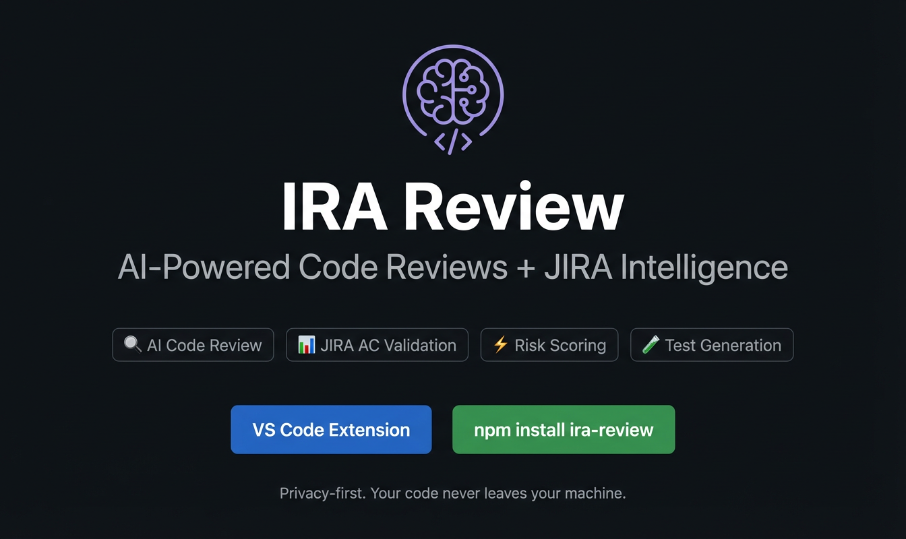

# IRA - Intelligent Review Assistant



**AI code reviews inside your editor. Privacy-first, runs locally. Zero plaintext secrets.**

[](https://marketplace.visualstudio.com/items?itemName=ira-review.ira-review-vscode)

---

## 🔒 Security First - Your Tokens Are Safe

IRA stores **every secret in your OS-native keychain**, not in `settings.json`.

| Secret | How it's stored |
|---|---|
| GitHub / GHE token | VS Code OAuth, stored in OS keychain (same mechanism as GitHub Copilot) |
| Bitbucket token | Prompted once via masked input, stored in OS keychain |
| SonarQube token | OS keychain via SecretStorage |
| JIRA token | OS keychain via SecretStorage |
| AI API key | OS keychain via SecretStorage |

- 🚫 No tokens in plaintext `settings.json` files
- 🔄 GitHub tokens auto-refresh. IRA detects session changes and invalidates stale tokens
- 🧹 `IRA: Sign Out` wipes all secrets from the keychain in one command
- 🤖 Copilot users need zero configuration. Uses your existing VS Code GitHub session
- 🏢 Works with GitHub Enterprise (org admin approval may be needed for the OAuth app)
- 📡 No cloud service, no telemetry, no token forwarding. Everything runs locally

> **For your security team:** IRA runs 100% locally. Code and credentials never leave your machine. The authentication module is fully auditable with complete test coverage.

---

## Features

- 🔒 **Zero Plaintext Secrets** - all tokens stored in OS keychain via SecretStorage
- 🔑 **One-Click GitHub OAuth** - sign in via VS Code's built-in OAuth. No PATs to manage
- 🔍 **AI-Powered Code Reviews** - review PRs using GitHub Copilot, OpenAI, Anthropic, or Ollama (local)
- 🎯 **Diagnostics** - issues show up as squiggly lines in your editor, just like TypeScript errors
- 📝 **CodeLens** - inline annotations on affected lines so you don't miss anything
- 🌳 **TreeView** - sidebar panel with all issues grouped by file
- 🛡️ **Risk Score** - status bar badge showing the overall risk level of your PR
- 🔗 **SonarQube + JIRA** - enrich reviews with static analysis and acceptance criteria validation
- 📢 **Slack & Teams Notifications** - get notified after reviews with risk threshold filtering
- 📋 **Generate PR Description** - AI-powered PR descriptions with JIRA ticket auto-detection from branch names

---

## Setup Guide - GitHub


1. Install the extension from the VS Code Marketplace
2. Open a project with a GitHub remote
3. Run `IRA: Sign In` from the Command Palette (`Cmd+Shift+P` / `Ctrl+Shift+P`)
4. Click "Sign in with GitHub" in the popup. VS Code handles the OAuth flow
5. Run `IRA: Review Current PR` and enter your PR number
6. Issues appear inline in your editor within seconds


That's it. Copilot is the default AI provider, so no API key is needed.

**GitHub Enterprise:** Works the same way. If your org has not approved the VS Code OAuth app, you can fall back to a PAT via `ira.githubToken` in settings.

## Setup Guide - Bitbucket

1. Install the extension from the VS Code Marketplace
2. Open a project with a Bitbucket remote
3. Run `IRA: Review Current PR` from the Command Palette
4. IRA auto-detects Bitbucket from your git remote URL
5. A masked input box appears: paste your Bitbucket access token (read-only scope)
6. The token is stored in the OS keychain. You will not be asked again
7. Issues appear inline in your editor within seconds


**Bitbucket Server / Data Center:** Set `ira.bitbucketUrl` in settings to your server URL (e.g. `https://bitbucket.yourcompany.com`).

## Optional Integrations

All integrations are optional. IRA works with just GitHub/Bitbucket + Copilot out of the box.

**SonarQube:**
1. Set `ira.sonarUrl` to your SonarQube server URL in settings
2. Set `ira.sonarProjectKey` in settings
3. IRA will prompt you for the Sonar token on first use and store it securely in the OS keychain

**JIRA:**
1. Set `ira.jiraUrl` and `ira.jiraEmail` in settings
2. IRA will prompt you for the JIRA token on first use and store it securely in the OS keychain

**Alternative AI provider (OpenAI, Anthropic, Ollama):**
1. Change `ira.aiProvider` in settings to `openai`, `anthropic`, or `ollama`
2. IRA will prompt you for the API key on first use and store it securely in the OS keychain (not needed for Ollama)

---

## Example Output

```
🔍 IRA: Found 3 issues (Risk: MEDIUM)

src/routes/todos.ts
  ⚠️ [IRA/security] SQL injection risk - user input not sanitized
  ℹ️ [IRA/performance] Missing database index on frequently queried column

src/middleware/auth.ts
  🔴 [IRA/security] JWT secret hardcoded - use environment variable
```

---

## Free vs Pro

| Feature                    | Free | Pro ($10/mo) |
| -------------------------- | :--: | :----------: |
| PR Reviews                 |  ✅  |      ✅      |
| Copilot AI (zero config)   |  ✅  |      ✅      |
| OpenAI / Anthropic / Ollama|  ✅  |      ✅      |
| Diagnostics + CodeLens     |  ✅  |      ✅      |
| TreeView + Risk Score      |  ✅  |      ✅      |
| SonarQube Integration      |  ✅  |      ✅      |
| JIRA AC Validation         |  ✅  |      ✅      |
| Auto-review on Save        |  -   |      ✅      |
| One-click Apply Fix        |  -   |      ✅      |
| Review History + Trends    |  -   |      ✅      |
| Post to PR (selective)     |  -   |      ✅      |
| Custom Review Rules        |  -   |      ✅      |
| Priority Support           |  -   |      ✅      |

---

## Supported Providers

### SCM

| Provider                          | Status |
| --------------------------------- | :----: |
| GitHub                            |   ✅   |
| GitHub Enterprise                 |   ✅   |
| Bitbucket Cloud                   |   ✅   |
| Bitbucket Server / Data Center    |   ✅   |

### AI

| Provider                          | Status |
| --------------------------------- | :----: |
| GitHub Copilot (zero config)      |   ✅   |
| OpenAI                            |   ✅   |
| Azure OpenAI                      |   ✅   |
| Anthropic                         |   ✅   |
| Ollama (local)                    |   ✅   |

---

## Configuration

Open **Settings > Extensions > IRA** or add these to your `settings.json`:

| Setting              | Description                                        | Default     |
| -------------------- | -------------------------------------------------- | ----------- |
| `ira.aiProvider`     | AI backend: `copilot`, `openai`, `anthropic`, `ollama` | `copilot`   |
| `ira.scmProvider`    | SCM platform: `github`, `bitbucket`                | auto-detect |
| `ira.bitbucketUrl`   | Base URL for Bitbucket Server / Data Center        |             |
| `ira.sonarUrl`       | SonarQube server URL                               |             |
| `ira.sonarProjectKey`| SonarQube project key                              |             |
| `ira.jiraUrl`        | JIRA instance URL for AC validation                |             |
| `ira.jiraEmail`      | JIRA account email                                 |             |
| `ira.slackWebhookUrl` | Slack webhook URL for review notifications        |             |
| `ira.teamsWebhookUrl` | Teams webhook URL for review notifications        |             |
| `ira.notifyMinRisk`   | Minimum risk level to trigger notifications: `low`, `medium`, `high`, `critical` | `low` |
| `ira.notifyOnAcFail`  | Notify when JIRA acceptance criteria fail          | `false` |

> **Note:** Token settings (`ira.sonarToken`, `ira.jiraToken`, `ira.aiApiKey`, `ira.githubToken`, `ira.bitbucketToken`) still exist for backward compatibility but are no longer recommended. Use `IRA: Sign In` to store tokens securely in the OS keychain instead.

---

## Need CLI or CI integration?

IRA also runs as a CLI tool and in CI pipelines (GitHub Actions, Bitbucket Pipelines). See the full setup guide:

📖 **[github.com/patilmayur5572/ira-review](https://github.com/patilmayur5572/ira-review)**

## Links

- **Marketplace**: [VS Code Marketplace](https://marketplace.visualstudio.com/items?itemName=ira-review.ira-review-vscode)
- **npm**: [npmjs.com/package/ira-review](https://www.npmjs.com/package/ira-review)
- **Support**: patilmayur5572@gmail.com
